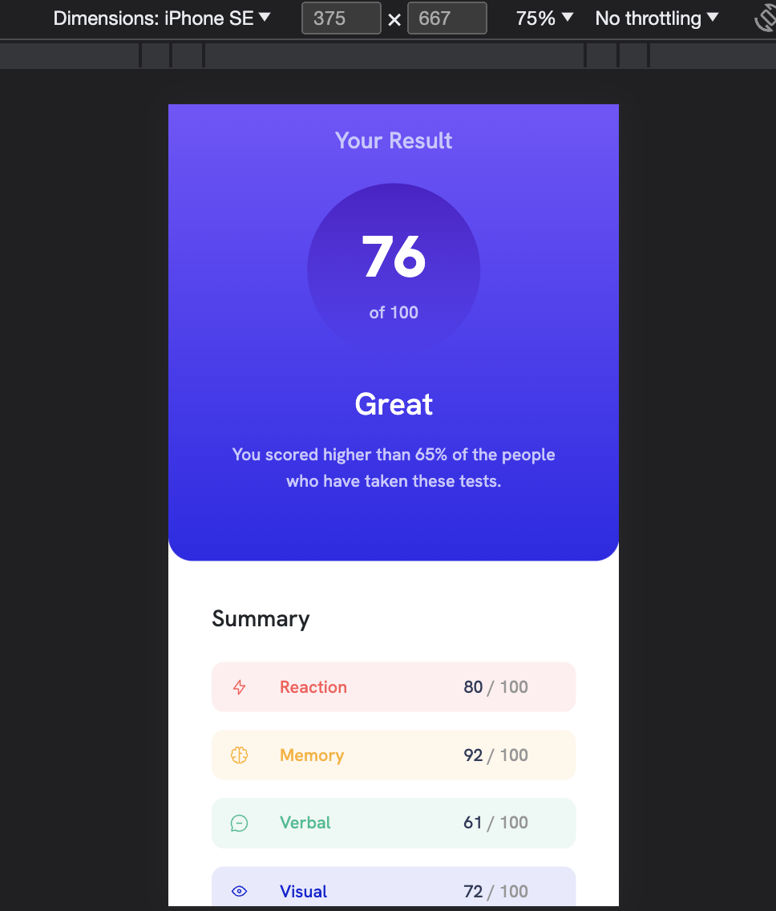
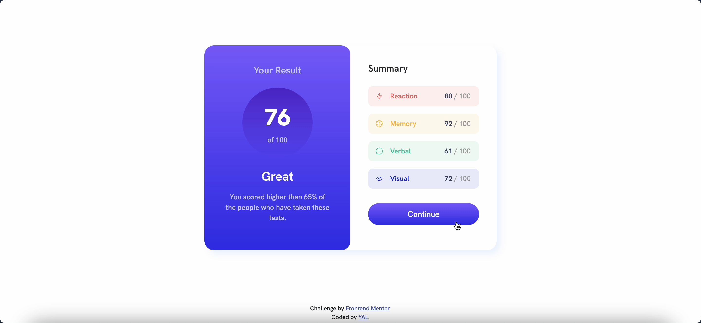

# Frontend Mentor - Results summary component solution

This is a solution to the [Results summary component challenge on Frontend Mentor](https://www.frontendmentor.io/challenges/results-summary-component-CE_K6s0maV). Frontend Mentor challenges help you improve your coding skills by building realistic projects. 

## Table of contents

- [Overview](#overview)
  - [The challenge](#the-challenge)
  - [Screenshot](#screenshot)
  - [Links](#links)
- [My process](#my-process)
  - [Built with](#built-with)
  - [What I learned](#what-i-learned)
  - [Continued development](#continued-development)
- [Author](#author)
- [Acknowledgments](#acknowledgments)

## Overview
### The challenge
Users should be able to:
- View the optimal layout for the interface depending on their device's screen size
- See hover and focus states for all interactive elements on the page

### Screenshot




### Links
- Live Site URL: [Add live site URL here](https://your-live-site-url.com)

## My process
### Built with
- Semantic HTML5 markup
- CSS custom properties
- Bootstrap
- Flexbox
- CSS Grid

### What I learned
練習grid 與 linear-gradient

```css
.card-body > div {
    align-items: center;
    border-radius: 10px;
    display: grid;
    font-size: 0.9rem;
    grid-template-rows: 1fr;
    grid-template-columns: 15% 55% 30%;
    margin-top: 15px;
    padding: 10px 10px 10px 15px;
}

.bg-linear-blue {
    background: linear-gradient(hsl(252, 100%, 67%), hsl(241, 81%, 54%));
}
```

### Continued development
CSS Grid

## Author
- Frontend Mentor - [@YAcodingroom]
(https://www.frontendmentor.io/profile/YAcodingroom)
- Threads - [@nt19_lya](https://www.threads.net/@nt19_lya)

## Acknowledgments
感謝Angela老師，感謝靜文老師，感謝Google，感謝Bootstrap，感謝小水豚工具書，感謝宇宙，感謝自己每天都能努力1%。
感謝每個生命中讓人會心一笑的事情，總是能成為我的動力。